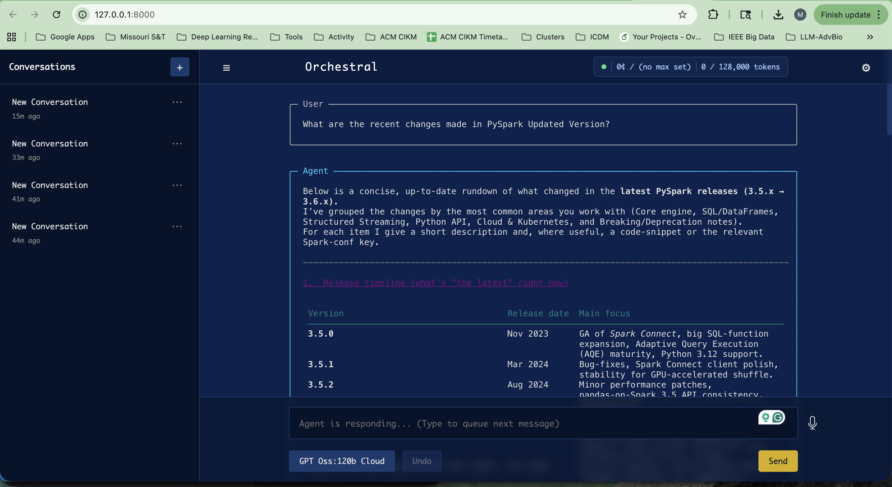
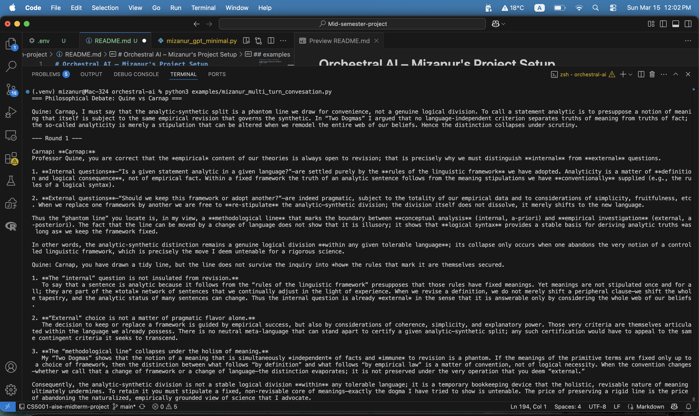

# Orchestral AI – Mizanur's Project Setup

CS-5001 AI Software Engineering | Mid-Semester Project | SP'26

---

## Overview

This project uses the [Orchestral AI](https://github.com/orchestralAI/orchestral-ai) framework to build and run LLM-powered agent applications. All examples have been adapted to use a local **Ollama** model (`gpt-oss:120b-cloud`) instead of cloud-based providers (OpenAI / Anthropic), and use `python-dotenv` for environment variable management.

But i have also used with the API keys for both Antropic and OpenAPI
---

## Requirements

- Python 3.13+
- [Ollama](https://ollama.com) installed and running locally
- The `gpt-oss:120b-cloud` model pulled in Ollama

## setup
### Setup
```bash
python3 -m venv .venv
source .venv/bin/activate
```

### Install dependencies

```bash
pip install orchestral-ai python-dotenv
```

### Pull the Ollama model

```bash
ollama pull gpt-oss:120b-cloud
```

### Start Ollama (must be running before executing any script)

```bash
ollama serve
```

---

## Environment Setup

Create a `.env` file in the project root:

```
# Only needed if using OpenAI-based scripts
OPENAI_API_KEY=sk-proj-...

# Only needed if using Anthropic-based scripts
ANTHROPIC_API_KEY=sk-ant-...
```

For Ollama-based scripts, no API key is required.

---

## Code Changes Made

All example scripts were modified with the following changes:

1. **Added `python-dotenv` loading** at the top of every script
2. **Replaced `Claude` / `GPT` imports** with `Ollama`
3. **Replaced model strings** with `"gpt-oss:120b-cloud"`
4. **Fixed broken import** — `import app.server as app_server` → `from orchestral.ui.app import server as app_server`

---

## Scripts & How to Run

### 1. Web UI – Ollama (`mizanur_demo.py`)

Launches a browser-based chat interface powered by the local Ollama model.

```python
from dotenv import load_dotenv
load_dotenv()

from orchestral import Agent
from orchestral.llm import Ollama
from orchestral.ui.app import server as app_server

agent = Agent(llm=Ollama(model="gpt-oss:120b-cloud"))
app_server.run_server(agent)
```

**Run:**
```bash
python examples/mizanur_minimal.py
```

Then open [http://127.0.0.1:8000](http://127.0.0.1:8000) in your browser.

---

### 2. Web UI – OpenAI (`mizanur_demo_openai.py`)

Same web interface but using OpenAI's GPT-4o. Requires `OPENAI_API_KEY` in `.env`.

```python
from dotenv import load_dotenv
load_dotenv()

from orchestral import Agent
from orchestral.llm import GPT
from orchestral.ui.app import server as app_server

agent = Agent(llm=GPT(model="gpt-4o"))
app_server.run_server(agent)
```

**Run:**
```bash
python examples/mizanur_demo_openai.py
```

---

### 3. Multi-Turn Conversation (`multi_turn_conversation.py`)

Two agents (Quine and Carnap) debate the analytic-synthetic distinction over 3 rounds.

```python
from dotenv import load_dotenv
load_dotenv()

from orchestral import Agent
from orchestral.llm import Ollama

agent_A = Agent(system_prompt="You are Quine...", llm=Ollama(model="gpt-oss:120b-cloud"))
agent_B = Agent(system_prompt="You are Carnap...", llm=Ollama(model="gpt-oss:120b-cloud"))
```

**Run:**
```bash
python examples/multi_turn_conversation.py
```

---

### 4. Streaming Responses (`streaming_responses.py`)

Streams a response token-by-token from the Ollama model in the terminal.

```python
from dotenv import load_dotenv
load_dotenv()

from orchestral import Agent
from orchestral.llm import Ollama

agent = Agent(
    llm=Ollama(model="gpt-oss:120b-cloud"),
    system_prompt="You are a helpful coding assistant."
)

for chunk in agent.stream_text_message("Write a Python function to calculate fibonacci numbers."):
    print(chunk, end='', flush=True)
```

**Run:**
```bash
python examples/streaming_responses.py
```

---

## Common Errors & Fixes

| Error | Cause | Fix |
|-------|-------|-----|
| `ModuleNotFoundError: No module named 'app'` | Broken import in README example | Use `from orchestral.ui.app import server as app_server` |
| `ValueError: OPENAI_API_KEY must be provided` | `Agent()` defaults to GPT | Pass `llm=Ollama(...)` or `llm=Claude(...)` explicitly |
| `Your credit balance is too low` | Anthropic account has no credits | Add credits at [console.anthropic.com](https://console.anthropic.com) or switch to Ollama |
| `Connection refused` on Ollama | Ollama not running | Run `ollama serve` first |

---

## Project Structure

```
orchestral-ai/
├── .env                        # API keys (not committed to git)
├── .env.example                # Template for .env
├── examples/
│   ├── mizanur_demo.py         # Web UI with Ollama
│   ├── mizanur_demo_openai.py  # Web UI with OpenAI
│   ├── multi_turn_conversation.py
│   └── streaming_responses.py
└── README.md                   # This file
```

---

## examples screenshot




## References

- [Orchestral AI GitHub](https://github.com/orchestralAI/orchestral-ai)
- [Orchestral AI Paper (arXiv:2601.02577)](https://arxiv.org/abs/2601.02577)
- [Ollama](https://ollama.com)
